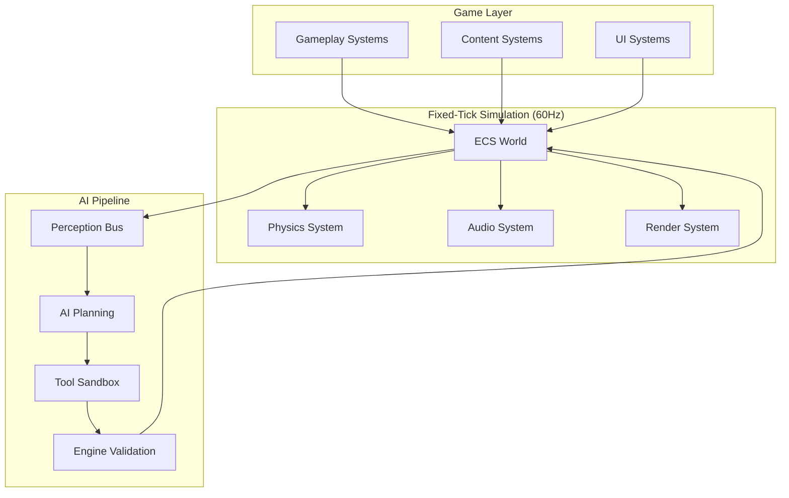

# Architecture Overview

AstraWeave represents a fundamental shift in game engine design: instead of treating AI as an afterthought, it places intelligent agents at the core of the architecture. This document explains the key architectural decisions and how they enable truly AI-native gameplay.

## Core Philosophy: AI-First Design

Traditional game engines follow this pattern:
```
Game Logic → AI System → Scripted Behaviors
```

AstraWeave inverts this relationship:
```
AI Agents ← Tool Validation ← Engine Authority
```

### Why This Matters

1. **No Cheating AI**: AI can only act through validated game systems
2. **Emergent Behavior**: Complex interactions emerge from simple, validated tools
3. **Multiplayer Ready**: Same validation works for human players and AI
4. **Predictable Performance**: Deterministic simulation enables reliable testing

## High-Level Architecture



## The Deterministic Core

### Fixed-Tick Simulation

AstraWeave runs the simulation at exactly 60Hz, regardless of rendering framerate:

```rust
const TICK_RATE: f64 = 60.0;
const TICK_DURATION: Duration = Duration::from_nanos(16_666_667); // 1/60 second

// Simulation always advances by exactly this amount
fn tick_simulation(&mut self) {
    self.world.step(TICK_DURATION);
}
```

**Benefits:**
- Deterministic physics and AI behavior
- Consistent timing across different hardware
- Reliable networking and replay systems
- Predictable performance testing

### Entity-Component-System (ECS)

AstraWeave uses an archetype-based ECS for cache-friendly performance:

```rust
// Components are pure data
#[derive(Component)]
struct Position(Vec3);

#[derive(Component)]  
struct AIAgent {
    perception_range: f32,
    planning_cooldown: Duration,
}

// Systems operate on component combinations
fn ai_perception_system(
    query: Query<(&Position, &AIAgent, &mut PerceptionState)>
) {
    for (pos, agent, mut perception) in query.iter_mut() {
        // Update agent perception based on world state
    }
}
```

**Key Benefits:**
- Cache-friendly data layout
- Parallel system execution  
- Clean separation of data and logic
- Easy to reason about and test

## The AI Pipeline

### 1. Perception Bus

AI agents receive structured snapshots of the world state:

```rust
#[derive(Serialize, Deserialize)]
pub struct PerceptionSnapshot {
    pub timestamp: u64,
    pub agent_id: EntityId,
    pub visible_entities: Vec<EntityData>,
    pub audio_events: Vec<AudioEvent>,
    pub world_state: WorldState,
}
```

**Design Principles:**
- **Filtered Information**: Agents only perceive what they should be able to see/hear
- **Structured Data**: JSON-serializable for easy AI model consumption
- **Temporal Consistency**: Snapshots include timing information
- **Bandwidth Efficient**: Only relevant changes are included

### 2. Planning Layer

AI models generate plans using the perception data:

```rust
pub struct AIPlan {
    pub agent_id: EntityId,
    pub intent: Intent,
    pub tools: Vec<ToolUsage>,
    pub confidence: f32,
    pub reasoning: String, // For debugging and learning
}

pub enum Intent {
    MoveTo { target: Vec3, urgency: f32 },
    AttackTarget { target: EntityId, weapon: Option<EntityId> },
    Interact { target: EntityId, interaction_type: String },
    Communicate { target: EntityId, message: String },
}
```

**Key Features:**
- **High-Level Intents**: AI thinks in terms of goals, not implementation
- **Tool-Based Actions**: All actions go through validated tools
- **Confidence Scoring**: Enables dynamic difficulty and behavior tuning
- **Explainable Reasoning**: For debugging and player understanding

### 3. Tool Validation

Every AI action must be validated by the engine:

```rust
pub trait Tool {
    fn validate(&self, world: &World, usage: &ToolUsage) -> ValidationResult;
    fn execute(&self, world: &mut World, usage: &ToolUsage) -> ExecutionResult;
}

// Example: Movement tool
impl Tool for MovementTool {
    fn validate(&self, world: &World, usage: &ToolUsage) -> ValidationResult {
        let agent = world.get::<Position>(usage.agent_id)?;
        let target = usage.target_position;
        
        // Check line of sight
        if !world.line_of_sight(agent.0, target) {
            return ValidationResult::Blocked(BlockReason::LineOfSight);
        }
        
        // Check movement cooldown
        if !self.cooldown_ready(usage.agent_id) {
            return ValidationResult::Blocked(BlockReason::Cooldown);
        }
        
        ValidationResult::Valid
    }
    
    fn execute(&self, world: &mut World, usage: &ToolUsage) -> ExecutionResult {
        // Actually perform the movement
        world.get_mut::<Position>(usage.agent_id)?.0 = usage.target_position;
        ExecutionResult::Success
    }
}
```

**Validation Categories:**
- **Physics Constraints**: Can the action physically happen?
- **Resource Requirements**: Does the agent have what's needed?
- **Cooldowns**: Is the action available now?
- **Line of Sight**: Can the agent see the target?
- **Game Rules**: Does this follow the game's rules?

## Networking Architecture

### Server Authority

AstraWeave uses server-authoritative validation for multiplayer:

```
Client AI → Intent → Server Validation → World Update → State Broadcast
```

**Benefits:**
- No client-side cheating possible
- Consistent world state across all clients
- AI agents validated same as human players
- Deterministic simulation enables easy rollback

### Intent Replication

Instead of replicating low-level actions, AstraWeave replicates high-level intents:

```rust
#[derive(Serialize, Deserialize)]
pub struct NetworkIntent {
    pub player_id: PlayerId,
    pub intent: Intent,
    pub timestamp: u64,
    pub predicted_outcome: Option<PredictedResult>,
}
```

**Advantages:**
- Lower bandwidth than action replication
- Natural lag compensation through prediction
- AI and human intents handled identically
- Easy to implement anti-cheat

## Performance Architecture

### CPU Performance

- **ECS Archetype Iteration**: Cache-friendly component access
- **Parallel Systems**: Independent systems run in parallel
- **Incremental Updates**: Only changed data is processed
- **Fixed Timestep**: Predictable CPU load

### Memory Management

- **Pool Allocation**: Entities and components use object pools
- **Streaming**: World chunks loaded/unloaded based on relevance
- **Compression**: Perception data compressed before AI processing
- **Garbage Collection**: Minimal allocations in hot paths

### GPU Utilization

- **Deferred Rendering**: Efficient handling of many lights
- **Instanced Rendering**: Batch similar objects
- **Compute Shaders**: Physics and AI calculations on GPU
- **Temporal Upsampling**: Maintain quality at lower resolution

## Modularity and Extensibility

### Crate Organization

```
astraweave-core/     # ECS, validation, core types
astraweave-ai/       # AI planning and perception
astraweave-physics/  # Physics integration
astraweave-render/   # Rendering pipeline
astraweave-audio/    # Audio system
astraweave-nav/      # Navigation and pathfinding
astraweave-net/      # Networking layer
```

### Plugin System

```rust
pub trait EnginePlugin {
    fn build(&self, app: &mut App);
}

pub struct CustomGamePlugin;

impl EnginePlugin for CustomGamePlugin {
    fn build(&self, app: &mut App) {
        app.add_system(custom_ai_behavior_system)
           .add_tool(CustomInteractionTool)
           .register_component::<CustomComponent>();
    }
}
```

## Security Model

### AI Sandboxing

AI agents cannot:
- Access arbitrary memory
- Execute arbitrary code
- Bypass tool validation
- Affect systems outside their permissions

AI agents can only:
- Receive perception data
- Generate high-level intents
- Use validated tools
- Learn from feedback

### Deterministic Security

The deterministic simulation enables:
- **Replay Verification**: Detect desync and cheating
- **Formal Verification**: Mathematical proof of certain properties
- **Predictable Testing**: Reliable automated testing
- **Audit Trails**: Complete history of all decisions

## Development Philosophy

### Composition Over Inheritance

```rust
// Instead of inheritance hierarchies
class AIAgent extends Entity { ... }

// Use component composition
struct Entity {
    components: HashMap<ComponentId, Box<dyn Component>>
}
```

### Data-Driven Design

```rust
// Behavior configured through data
#[derive(Deserialize)]
struct AIProfile {
    aggression: f32,
    curiosity: f32,
    risk_tolerance: f32,
    preferred_tools: Vec<String>,
}
```

### Testable Architecture

```rust
// Every system is pure and testable
fn ai_planning_system(
    world: &World, 
    perceptions: &[PerceptionSnapshot]
) -> Vec<AIPlan> {
    // Pure function - easy to test
}
```

## Comparison with Traditional Engines

| Aspect | Traditional Engine | AstraWeave |
|--------|-------------------|------------|
| AI Integration | Bolted-on scripting | Core architecture |
| Action Validation | Trust-based | Engine-validated |
| Determinism | Variable | Fixed-tick |
| Networking | Action replication | Intent replication |
| Performance | Variable | Predictable |
| Testing | Difficult | Deterministic |

## Next Steps

To understand specific systems:
- [AI-Native Design](./ai-native.md) - Deep dive into AI architecture
- [ECS Architecture](./ecs.md) - Entity-Component-System details  
- [Deterministic Simulation](./deterministic.md) - Fixed-tick simulation
- [Tool Validation System](./tool-validation.md) - How AI actions are validated

To start building:
- [Building Your First Game](../game-dev/first-game.md)
- [Core Systems](../core-systems/ai/index.md)
- [Working Examples](../examples/index.md)